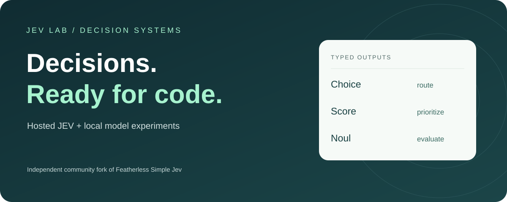
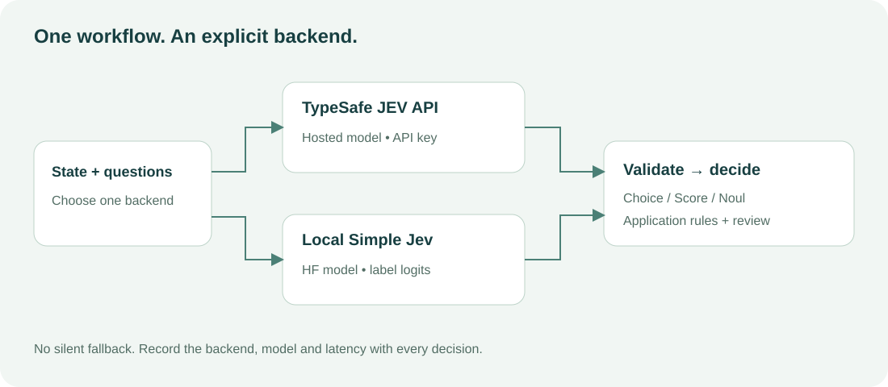

# JEV Lab

**Build applications around typed decisions.** Use real hosted **TypeSafe JEV**, or run **Simple Jev** locally with a compatible Hugging Face model. This independent fork adds a lightweight client, workflow examples and Gymnasium experiments to [Featherless Simple Jev](https://github.com/featherless-ai/simple-jev).

[Get started](#get-started) · [Architecture](#how-it-fits-together) · [Notebooks](#interactive-experiments) · [API reference](hf-server/API_REFERENCE.md) · [Audit and gaps](docs/REPOSITORY_AUDIT.md)

## Choose your engine

| | Real JEV | Local Simple Jev |
| --- | --- | --- |
| Implementation | TypeSafe's hosted model | HF language model, restricted next-token logits |
| Endpoint | `https://api.typesafe.ai/v1/systemone` | `http://127.0.0.1:8000/v1/classifier` |
| Requirements | TypeSafe access and API key | Python 3.12+, model weights and CPU/GPU |
| Credentials | `TYPESAFE_API_KEY` | None for default loopback server |
| Confidence | Returned by TypeSafe; distinct from choice probability | Maximum allowed-label probability; not calibrated correctness |
| Execution | Remote inference | Inference on your machine |

**This is an integration and experimentation toolkit, not TypeSafe's model weights, architecture or RLCD training implementation.** RFDT is the upstream task-specific training pipeline; it is not RLCD. A valid decision can still be wrong.

## Get started

```bash
git clone https://github.com/vtavakkoli/simple-jev.git
cd simple-jev
```

### Real JEV — no local model required

Set `TYPESAFE_API_KEY` in your environment using the key from your [TypeSafe dashboard](https://console.typesafe.ai/). The included `jev` client uses Python's standard library and runs directly from this checkout:

```bash
python -m examples.triage --backend typesafe
```

This submits one request with Choice, Score and Noul questions and returns the backend/model, measured request latency, distributions and an application routing decision. Low confidence routes to review. The example threshold is illustrative, not calibrated for your task. Requests consume your provider quota; errors stop the call without retries or backend substitution.

### Local inference

```bash
python -m pip install -e './hf-server'
python hf-server/hf_server.py --model Qwen/Qwen3.5-0.8B --device cpu --dtype float32
# In another terminal, from the repository root:
python -m examples.triage --backend local
```

For GPU setup, prompt/cache behavior and detailed curl examples, see the [local server guide](docs/local-server-guide.md) and [HF server documentation](hf-server/README.md).

### Use it in your code

```python
from jev import DecisionClient

client = DecisionClient("typesafe")
result = client.decide(
    state="Please refund my duplicate payment.",
    questions={"refund": {"type": "noul", "instructions": "Is a refund explicitly requested?"}},
)
print(result["answers"]["refund"]["noul"])
```

The client validates answer IDs, types, ranges and distributions. It preserves provider confidence rather than replacing it with maximum probability. `DecisionError` signals HTTP, network or invalid-response failures. No fabricated success, automatic heuristic takeover, or hidden backend change.

## How it fits together



Use narrow questions and compose their answers in ordinary code. Keep inference, validation, confidence thresholds and action execution visible. The two backends have different model capabilities and confidence semantics: sharing an interface does not establish equivalent performance.

## Interactive experiments

| Notebook | Engine | What it actually demonstrates |
| --- | --- | --- |
| [JEV Quickstart](notebooks/Jev_Quickstart.ipynb) · [Colab](https://colab.research.google.com/github/vtavakkoli/simple-jev/blob/main/notebooks/Jev_Quickstart.ipynb) | Real TypeSafe JEV | One mixed-question request, latency and confidence-aware routing |
| [CarRacing](notebooks/Jev_CarRacing_Colab.ipynb) · [Colab](https://colab.research.google.com/github/vtavakkoli/simple-jev/blob/main/notebooks/Jev_CarRacing_Colab.ipynb) | Real TypeSafe JEV | Direct steering/pedal choices; optional assisted mode is separately labelled |
| [BipedalWalker](notebooks/Jev_API_BipedalWalker_Controller_Colab.ipynb) · [Colab](https://colab.research.google.com/github/vtavakkoli/simple-jev/blob/main/notebooks/Jev_API_BipedalWalker_Controller_Colab.ipynb) | Real TypeSafe JEV + heuristic | JEV selects gait speed; a heuristic controls joints. Not generic learned locomotion |
| [Gymnasium](notebooks/Jev_Gymnasium.ipynb) · [Colab](https://colab.research.google.com/github/vtavakkoli/simple-jev/blob/main/notebooks/Jev_Gymnasium.ipynb) | Local HF / Qwen | CartPole/Pendulum experiments and optional HalfCheetah |

Notebook control results are exploratory. Simulation pauses during requests; smooth playback does not prove real-time control. Direct JEV racing has not been validated with a live API run. Protect API keys with Colab Secrets and clear outputs before sharing.

## Explore the interface

```bash
python -m http.server 8765 --bind 127.0.0.1 --directory website
```

Visit `http://127.0.0.1:8765` for the redesigned homepage, playground and API documentation. The browser playground uses **Featherless's public Simple Jev backend**, not TypeSafe JEV. It sends state only when you run a request. Use the Python client or notebooks for authenticated TypeSafe calls.

## Project map

| Directory | Purpose |
| --- | --- |
| `jev/` | Dependency-free hosted/local client and response validation |
| `examples/` | Executable decision workflows |
| `tests/` | Offline client transport and contract tests |
| `common/` | Upstream prompt, schema and scoring implementation |
| `hf-server/` | Local Transformers server and inference tests |
| `RFDT/` | Upstream decision-logit fine-tuning tools |
| `notebooks/` | Hosted and local experiments, explicitly labelled |
| `website/` | Static homepage, public playground, docs and demos |
| `docs/` | Audit, boundaries and extended setup guide |

## Verify

```bash
# No model, key, or third-party packages needed:
python -m unittest discover -s tests -v
node --test website/tests/*.test.mjs
# Local inference framework (downloads Python dependencies, not pretrained weights):
python -m pip install -e './hf-server[test]'
python -m pytest -c hf-server/pyproject.toml common/tests hf-server/tests -q
```

Offline tests establish implementation behavior, not live JEV performance or model accuracy. Live validation requires your TypeSafe account or a running local model.

## Attribution and boundaries

Built on [Featherless AI's Simple Jev](https://github.com/featherless-ai/simple-jev). JEV and TypeSafe belong to their respective owners; this fork is not an official TypeSafe or Featherless product. New visual assets identify this community fork and do not replace upstream attribution. See [the official TypeSafe quickstart](https://docs.typesafe.ai/introduction/quickstart) for the hosted contract.

The repository currently has no root license file. This update does not invent licensing terms or relicense inherited code; upstream licensing should be clarified before redistribution. Website deployment is opt-in and requires your own hosting configuration.
